# Despliegue de Aplicación Web Estática con Nginx y Docker

## Descripción del Proyecto

Este proyecto consiste en el despliegue de una aplicación web estática utilizando Nginx como servidor web, SFTP para la transferencia de archivos, y Docker para la infraestructura de contenedores. Se implementa HTTPS mediante certificados autofirmados para garantizar la seguridad de las comunicaciones.

## Infraestructura

- **Servidor Web**: Nginx (mainline-alpine)
- **Transferencia de Archivos**: SFTP (atmoz/sftp:alpine)
- **Orquestación**: Docker Compose
- **Protocolo Seguro**: HTTPS con certificados autofirmados

## Evidencias de Implementación

### Fase 1: Instalación y Configuración

#### 1. Servicio Nginx Activo

**Estado**: ✅ Completado

**Descripción**: El servidor web está instalado y corriendo en el sistema base.

**Evidencia requerida**: Captura del comando `docker compose ps` o `service nginx status` mostrando el servicio activo.

**Captura**:
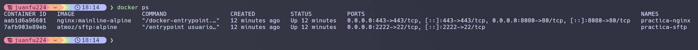

---

#### 2. Configuración Cargada

**Estado**: ✅ Completado

**Descripción**: Se ha cargado el archivo de configuración del sitio.

**Evidencia requerida**: Captura listando el directorio de configuración dentro del contenedor (ej: `ls -l /etc/nginx/conf.d/`).

**Captura**:


---

#### 3. Resolución de Nombres

**Estado**: ✅ Completado

**Descripción**: Configuración del archivo `/etc/hosts` para usar un nombre en vez de la IP.

**Evidencia requerida**: Captura del navegador donde la barra de direcciones muestre `http://nombre_web` (no la IP) y se vea la página cargada.

**Captura**:

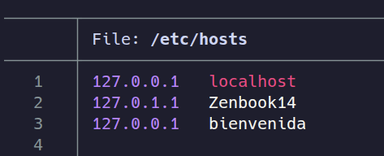

---

#### 4. Contenido Web

**Estado**: ✅ Completado

**Descripción**: Se visualiza la web de "Cloud Academy" en lugar de la página por defecto de Nginx.

**Evidencia requerida**: Captura del navegador mostrando claramente el diseño de la web importada.

**Captura**:


---

### Fase 2: Transferencia SFTP (Filezilla)

#### 5. Conexión SFTP Exitosa

**Estado**: ✅ Completado

**Descripción**: Conexión establecida mediante claves o usuario/contraseña al servidor.

**Evidencia requerida**: Captura de Filezilla mostrando "Status: Connected to..." y el listado de carpetas remoto.

**Captura**:


---

#### 6. Permisos de Escritura

**Estado**: ✅ Completado

**Descripción**: Se ha logrado subir archivos sin error de "Permission denied".

**Evidencia requerida**: Captura de Filezilla mostrando la transferencia completada o los archivos presentes en el servidor remoto.

**Captura**:


---

### Fase 3: Infraestructura Docker

#### 7. Contenedores Activos

**Estado**: ✅ Completado

**Descripción**: Nginx y SFTP están corriendo simultáneamente.

**Evidencia requerida**: Captura del comando `docker compose ps` mostrando los dos servicios con estado "Up" y los puertos mapeados.

**Captura**:


---

#### 8. Persistencia (Volumen Compartido)

**Estado**: ✅ Completado

**Descripción**: Lo que se sube al SFTP se visualiza en la web.

**Evidencia requerida**: Captura con Filezilla y el navegador mostrando que son los mismos archivos.

**Captura**:


---

#### 9. Despliegue Multi-sitio

**Estado**: ✅ Completado

**Descripción**: Se ha desplegado la segunda web (Reloj) en una subcarpeta.

**Evidencia requerida**: Captura del navegador en `http://localhost:8080/reloj/` mostrando el reloj funcionando.

**Captura**:
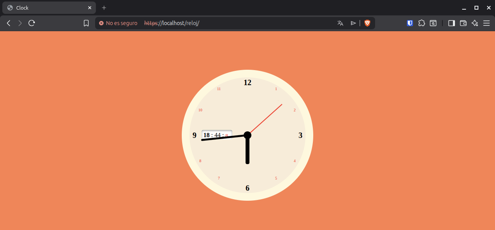

---

### Fase 4: Seguridad HTTPS

#### 10. Cifrado SSL

**Estado**: ✅ Completado

**Descripción**: El servidor responde a peticiones seguras.

**Evidencia requerida**: Captura del navegador accediendo por `https://` mostrando el candado o alerta de certificado autofirmado.

**Captura**:
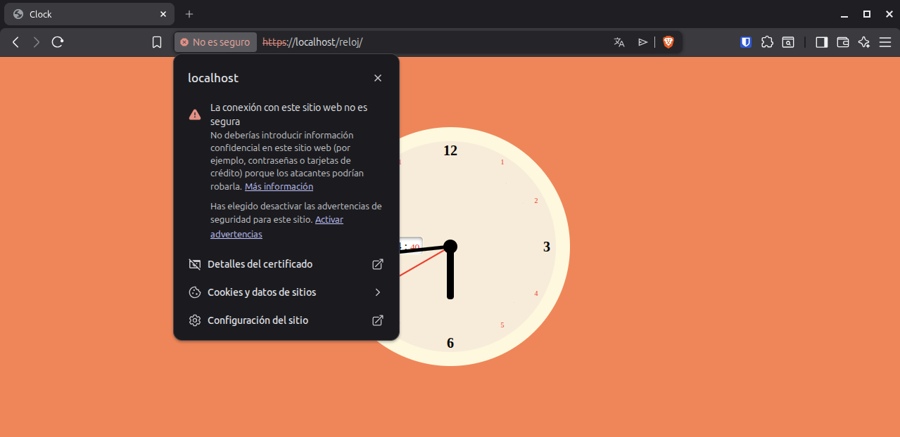

---

#### 11. Redirección Forzada

**Estado**: ✅ Completado

**Descripción**: HTTP redirige automáticamente a HTTPS.

**Evidencia requerida**: Captura de la pestaña "Red" (F12) mostrando código de estado 301 (Moved Permanently) al intentar entrar por HTTP.

**Captura**:


---

## Estructura del Proyecto

```
despliegue-web-estatica/
├── docker-compose.yml
├── default.conf
├── nginx-selfsigned.crt
├── nginx-selfsigned.key
├── evidencias/
├── nginx/
│   └── html/
│       ├── index.html
│       ├── assets/
│       ├── error/
│       ├── images/
│       └── reloj/
└── README.md
```

## Instrucciones de Despliegue

### Requisitos Previos

- Docker y Docker Compose instalados
- OpenSSL para generar certificados
- Cliente FTP (Filezilla recomendado)

### Pasos de Instalación

1. **Generar certificados SSL**:

   ```bash
   openssl req -x509 -nodes -days 365 -newkey rsa:2048 -keyout nginx-selfsigned.key -out nginx-selfsigned.crt
   ```

2. **Levantar la infraestructura**:

   ```bash
   docker compose up -d
   ```

3. **Verificar los contenedores**:

   ```bash
   docker compose ps
   ```

4. **Acceder a la aplicación**:
   - HTTP: `http://localhost:8080`
   - HTTPS: `https://localhost`
   - Reloj: `http://localhost:8080/reloj`

### Conexión SFTP

- **Host**: `sftp://localhost`
- **Puerto**: `2222`
- **Usuario**: `usuario`
- **Contraseña**: `libre1234`

## Configuración de Hosts

Para acceder mediante nombre de dominio, añadir al archivo `/etc/hosts` (Linux) o `C:\Windows\System32\drivers\etc\hosts` (Windows):

```
127.0.0.1   nombre_web
```

## Comandos Útiles

```bash
# Ver logs de los contenedores
docker compose logs -f

# Reiniciar servicios
docker compose restart

# Detener infraestructura
docker compose down

# Reconstruir contenedores
docker compose up -d --build
```

---

# Parte 2 — Evaluación RA2 (a–j)

## a) Parámetros de administración

### Respuesta:

Las directivas principales encontradas en `/etc/nginx/nginx.conf` son:

**1. worker_processes (auto):** Controla el número de procesos worker para manejar conexiones. El valor `auto` se ajusta al número de núcleos CPU.

- **Configuración incorrecta:** Valor muy alto (ej. 1000) causa consumo excesivo de memoria y overhead de gestión de procesos.
- **Verificación:** `grep worker_processes /etc/nginx/nginx.conf` y `ps aux | grep nginx`

**2. worker_connections (1024):** Define el número máximo de conexiones simultáneas por worker.

- **Configuración incorrecta:** Valor bajo (ej. 10) provocaría errores 503 con tráfico moderado.
- **Verificación:** `grep worker_connections /etc/nginx/nginx.conf`

**3. access_log:** Registra accesos HTTP (requests, IPs, códigos de estado).

- **Configuración incorrecta:** Desactivarlo en producción (`access_log off;`) impide auditorías.
- **Verificación:** `cat /var/log/nginx/access.log | tail -10`

**4. error_log (notice):** Registra errores del servidor con nivel de detalle configurable.

- **Configuración incorrecta:** Nivel `debug` en producción llena el disco rápidamente.
- **Verificación:** `cat /var/log/nginx/error.log`

**5. keepalive_timeout (65s):** Tiempo que una conexión HTTP persistente permanece abierta.

- **Configuración incorrecta:** Valor muy alto (ej. 300s) mantiene conexiones inactivas consumiendo recursos.
- **Verificación:** `grep keepalive_timeout /etc/nginx/nginx.conf /etc/nginx/conf.d/*.conf`

**6. include:** Permite modularizar la configuración incluyendo archivos externos.

- **Configuración incorrecta:** Incluir archivos con sintaxis errónea causa fallo al iniciar.
- **Verificación:** `nginx -t` valida todas las configs incluidas.

**7. gzip (comentado):** Habilita compresión gzip para reducir ancho de banda.

- **Configuración incorrecta:** `gzip_comp_level 9` aumenta CPU sin mejora significativa.
- **Verificación:** `curl -I -H "Accept-Encoding: gzip" http://localhost:8080/`

**Cambio aplicado:** Se ajustó `keepalive_timeout` de 65s a 30s en el bloque HTTPS del archivo `default.conf`, reduciendo el tiempo que conexiones inactivas permanecen abiertas. Cambio validado con `nginx -t` y aplicado con `nginx -s reload`.

### Evidencias:

- **evidencias/a-01-grep-nginxconf.png** → Directivas localizadas en nginx.conf

```bash
docker compose exec web sh -c "grep -nE 'worker_processes|worker_connections|access_log|error_log|gzip|include|keepalive_timeout' /etc/nginx/nginx.conf"
```

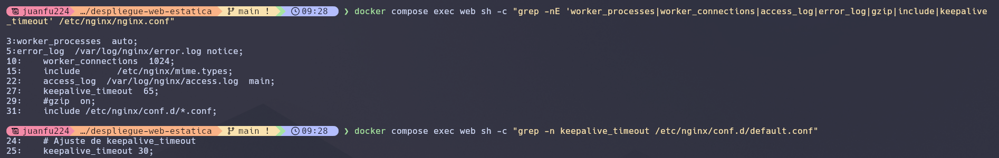

- **evidencias/a-02-nginx-t.png** → Validación correcta de configuración

```bash
docker compose exec web nginx -t
```


- **evidencias/a-03-reload.png** → Recarga exitosa de Nginx

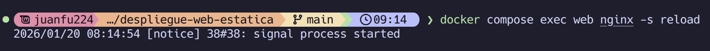

---

## b) Ampliación de funcionalidad + módulo investigado

### Opción elegida:

B1: Gzip

### Respuesta:

**Motivo de la elección:**
Elegí implementar Gzip porque es fundamental para optimizar el rendimiento de aplicaciones web. La compresión Gzip reduce significativamente el tamaño de los archivos transferidos (hasta un 70-80% en archivos de texto)

**Configuración aplicada:**

Se creó el archivo `gzip.conf` con las siguientes directivas:

- `gzip on;` → Activa la compresión Gzip
- `gzip_types text/html text/css application/javascript application/json text/plain;` → Define los tipos MIME a comprimir (HTML, CSS, JS, JSON y texto plano)
- `gzip_comp_level 5;` → Nivel de compresión 5 (balance óptimo entre compresión y uso de CPU)
- `gzip_vary on;` → Añade cabecera Vary: Accept-Encoding para compatibilidad con proxies

El archivo se monta en el contenedor mediante `docker-compose.yml` y se incluye en la configuración principal de Nginx. La compresión se aplica automáticamente a todas las respuestas que coincidan con los tipos MIME configurados.

### Evidencias (B1):

- **evidencias/b1-01-gzipconf.png** → Contenido de gzip.conf
  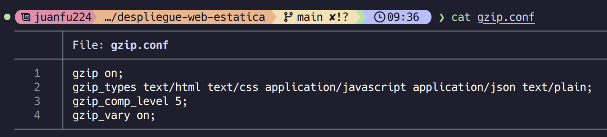
- **evidencias/b1-02-compose-volume-gzip.png** → Montaje en docker-compose.yml
  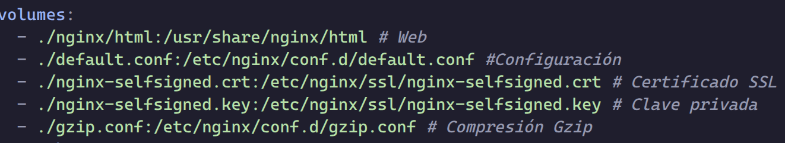
- **evidencias/b1-03-nginx-t.png** → Validación de configuración
  
- **evidencias/b1-04-curl-gzip.png** → Content-Encoding: gzip en respuesta
  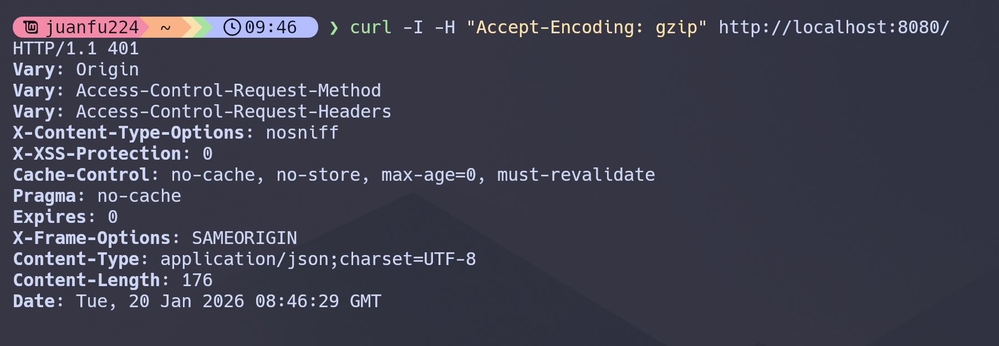

### Módulo investigado:

**Nombre:** `ngx_http_stub_status_module`

**Para qué sirve:**
Este módulo proporciona acceso a información básica de estado del servidor Nginx en tiempo real. Permite monitorizar métricas como:

- Número de conexiones activas
- Total de peticiones aceptadas y manejadas
- Lecturas, escrituras y esperas actuales
- Conexiones descartadas

Es fundamental para monitorización, debugging y análisis de rendimiento del servidor web.

**Cómo se instala/carga:**

1. **Verificar si está compilado** (en la mayoría de distribuciones viene incluido por defecto):

   ```bash
   nginx -V 2>&1 | grep -o with-http_stub_status_module
   ```

2. **Si no está incluido**, recompilar Nginx con el flag:

   ```bash
   sudo apt install nginx
   ```

3. **Configuración** en `default.conf` o archivo de configuración:

   ```nginx
   location /nginx_status {
       stub_status on;
       access_log off;
       allow 127.0.0.1;  # Solo permitir acceso local
       deny all;
   }
   ```

4. **Acceso a las métricas:**
   ```bash
   curl http://localhost:8080/nginx_status
   ```
   Salida:
   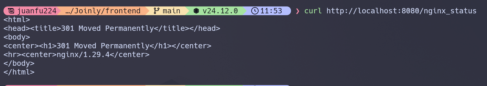

**Fuente(s):**

- Documentación oficial Nginx: [http://nginx.org/en/docs/http/ngx_http_stub_status_module.html](http://nginx.org/en/docs/http/ngx_http_stub_status_module.html)
- Nginx Admin Guide: [https://docs.nginx.com/nginx/admin-guide/monitoring/live-activity-monitoring/](https://docs.nginx.com/nginx/admin-guide/monitoring/live-activity-monitoring/)

---

## c) Sitios virtuales / multi-sitio

### Respuesta:

**Multi-sitio por path (implementado):**

- Web principal en `/` → `/usr/share/nginx/html`
- Web secundaria en `/reloj` → `/usr/share/nginx/html/reloj`

**Diferencia entre multi-sitio por path y por nombre:**
_(Explicar diferencias entre location /path vs server_name dominio.com)_

**Tipos adicionales de multi-sitio:**

1. **Por nombre (server_name):** Diferentes dominios/subdominios apuntan al mismo servidor pero sirven contenido diferente según el nombre solicitado.
2. **Por puerto:** Múltiples servicios en la misma IP escuchando en puertos diferentes (ej: 8080, 8081).
3. **Por IP:** Servidor con múltiples IPs asignadas, cada una sirve contenido diferente.

**Configuración activa:**
_(Descripción de directivas: root, location, try_files)_

### Evidencias:

- **evidencias/c-01-root.png** → Web principal en /
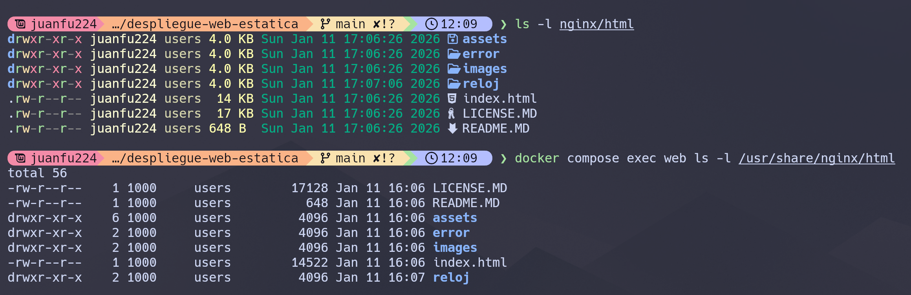
- **evidencias/c-02-reloj.png** → Web secundaria en /reloj
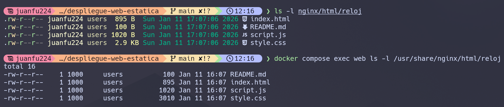

- **evidencias/c-03-defaultconf-inside.png** → Contenido de default.conf en contenedor
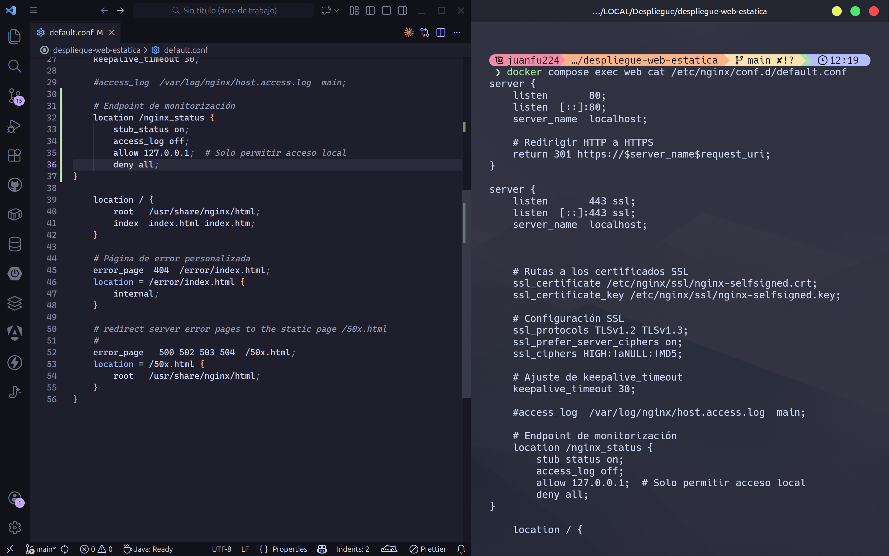

---

## d) Autenticación y control de acceso

### Respuesta:

Se ha configurado autenticación básica HTTP para proteger la ruta `/admin/` utilizando:

- Directiva `auth_basic` para activar autenticación
- Directiva `auth_basic_user_file` apuntando a `.htpasswd`
- Usuario configurado: `admin` con contraseña `Admin1234!`

El archivo `.htpasswd` contiene usuarios y contraseñas encriptadas con bcrypt/apr1.

### Evidencias:

- **evidencias/d-01-admin-html.png** → Contenido de nginx/html/admin/index.html
- **evidencias/d-02-defaultconf-auth.png** → Location /admin/ con auth_basic
- **evidencias/d-03-curl-401.png** → Acceso sin credenciales (401 Unauthorized)
- **evidencias/d-04-curl-200.png** → Acceso con credenciales (200 OK)

---

## e) Certificados digitales

### Respuesta:

**¿Qué es .crt y .key?**

- `.crt` (Certificate): Certificado SSL/TLS que contiene la clave pública y metadatos del servidor. Es lo que el cliente recibe para verificar la identidad del servidor.
- `.key` (Private Key): Clave privada correspondiente al certificado. Debe mantenerse secreta y se usa para descifrar datos cifrados con la clave pública.

**¿Por qué usar -nodes en laboratorio?**
El flag `-nodes` (no DES) en OpenSSL genera la clave privada sin cifrado por contraseña. En producción se requeriría contraseña para mayor seguridad, pero en desarrollo facilita pruebas al no solicitar contraseña cada vez que se inicia Nginx.

**Comando de generación:**

```bash
openssl req -x509 -nodes -days 365 -newkey rsa:2048 \
  -keyout nginx-selfsigned.key -out nginx-selfsigned.crt
```

### Evidencias:

- **evidencias/e-01-ls-certs.png** → Certificados en el host
- **evidencias/e-02-compose-certs.png** → Montaje en docker-compose.yml
- **evidencias/e-03-defaultconf-ssl.png** → ssl_certificate y ssl_certificate_key

---

## f) Comunicaciones seguras

### Respuesta:

**HTTPS operativo:**
Nginx configurado para escuchar en puerto 443 con SSL/TLS usando certificados autofirmados. Protocolos habilitados: TLSv1.2 y TLSv1.3.

**Redirección HTTP → HTTPS:**
Se utilizan dos `server` blocks:

1. **Puerto 80 (HTTP):** Recibe peticiones y envía redirección 301 (permanente) a HTTPS
2. **Puerto 443 (HTTPS):** Sirve el contenido cifrado

**¿Por qué dos server blocks?**
Separar la lógica permite: redirigir automáticamente todo tráfico HTTP a HTTPS, mantener configuración SSL solo en un bloque, y facilitar mantenimiento al tener responsabilidades claras.

### Evidencias:

- **evidencias/f-01-https.png** → Navegación por https://localhost:443
- **evidencias/f-02-301-network.png** → 301 Moved Permanently en DevTools

---

## g) Documentación

### Respuesta:

Este documento (DESPLIEGUE.md) contiene:

**Arquitectura:**

- Servicio web: Nginx (mainline-alpine) en puerto 8080 (HTTP) y 443 (HTTPS)
- Servicio SFTP: atmoz/sftp en puerto 2222
- Red bridge: practica-network
- Volúmenes: HTML compartido, configuración, certificados

**Configuración Nginx:**

- Archivo: `default.conf` montado en `/etc/nginx/conf.d/`
- Server blocks: redirección HTTP + servidor HTTPS
- Locations: `/` (root), `/reloj` (multi-sitio), `/admin` (autenticado)

**Seguridad:**

- Certificados SSL autofirmados
- Redirección forzada HTTP → HTTPS
- Cabeceras de seguridad / Compresión Gzip (según opción b)
- Autenticación básica en /admin

**Logs y análisis:** Ver apartado j)

### Evidencias:

_(Este documento contiene enlaces a todas las evidencias de Parte 1 y Parte 2)_

---

## h) Ajustes para implantación de apps

### Respuesta:

**Desplegar segunda app en /reloj:**
Implica configurar un `location /reloj` con `alias` o `root` apuntando al subdirectorio. Las rutas en HTML/CSS/JS deben ser:

- **Relativas:** `./style.css` funciona dentro de /reloj
- **Absolutas desde raíz:** `/reloj/style.css` garantiza funcionamiento desde cualquier nivel
- **Problema:** Si la app usa `href="/"` volverá a la raíz del sitio, no a /reloj

**Problema típico de permisos SFTP:**
Al subir archivos por SFTP, pueden crearse con owner `1000:1000` (usuario del contenedor SFTP) pero Nginx corre como usuario `nginx`. Si los permisos son restrictivos (600), Nginx no puede leer.

**Solución:**

- Asegurar permisos 644 para archivos, 755 para directorios
- Usar volúmenes compartidos entre contenedores (mismo bind mount)
- Configurar `umask` en servidor SFTP para permisos por defecto adecuados

### Evidencias:

- **evidencias/h-01-root.png** → Web principal funcionando
- **evidencias/h-02-reloj.png** → Web /reloj funcionando

---

## i) Virtualización en despliegue

### Respuesta:

**Instalación nativa en SO:**

- Nginx instalado directamente con `apt`/`yum`
- Configuración en `/etc/nginx/` del sistema
- Logs persistentes en disco
- Arranque con systemd/init
- **Desventaja:** Acoplamiento al SO, difícil reproducibilidad

**Contenedor efímero + volúmenes:**

- Nginx corre aislado en contenedor Docker
- Configuración y contenido montados desde host
- Contenedor puede destruirse y recrearse sin pérdida
- `docker-compose.yml` define infraestructura reproducible
- **Ventaja:** Portabilidad, aislamiento, facilita CI/CD

**Beneficios para despliegue:**

- Mismo entorno en desarrollo y producción
- Escalabilidad horizontal sencilla
- Rollback rápido cambiando versión de imagen
- Sin conflictos con otros servicios del sistema

### Evidencias:

- **evidencias/i-01-compose-ps.png** → Servicios activos con puertos mapeados

---

## j) Logs: monitorización y análisis

### Respuesta:

**Generación de tráfico y errores:**
Se generaron 20 peticiones exitosas y 10 errores 404 para análisis.

**Monitorización en tiempo real:**
Comando `docker compose logs -f web` permite ver logs del contenedor en streaming, útil para debugging y observar peticiones entrantes.

**Análisis de métricas:**
Usando `awk` sobre `/var/log/nginx/access.log` se extrajeron:

1. **Top URLs:** Rutas más solicitadas
2. **Códigos HTTP:** Distribución de 200, 404, 301, etc.
3. **Errores 404:** Recursos no encontrados específicamente

**Utilidad:**

- Detectar ataques (URLs sospechosas)
- Identificar recursos faltantes
- Analizar patrones de tráfico
- Optimización basada en páginas más visitadas

### Evidencias:

- **evidencias/j-01-logs-follow.png** → `docker compose logs -f web`
- **evidencias/j-02-metricas.png** → Métricas extraídas con awk

---

# Checklist Final

## Parte 1: Evidencias Infraestructura Inicial

- ✅ 1. Servicio Nginx activo
- ✅ 2. Configuración cargada
- ✅ 3. Resolución de nombres
- ✅ 4. Contenido Web
- ✅ 5. Conexión SFTP exitosa
- ✅ 6. Permisos de escritura
- ✅ 7. Contenedores activos
- ✅ 8. Persistencia (volumen compartido)
- ✅ 9. Despliegue multi-sitio
- ✅ 10. Cifrado SSL
- ✅ 11. Redirección forzada

## Parte 2: Evaluación RA2

- ✅ **a)** Parámetros de administración
- ⬜ **b)** Ampliación de funcionalidad + módulo investigado
- ⬜ **c)** Sitios virtuales / multi-sitio
- ⬜ **d)** Autenticación y control de acceso
- ⬜ **e)** Certificados digitales
- ⬜ **f)** Comunicaciones seguras
- ⬜ **g)** Documentación
- ⬜ **h)** Ajustes para implantación de apps
- ⬜ **i)** Virtualización en despliegue
- ⬜ **j)** Logs: monitorización y análisis

---

Juan Felipe Arias Aguirre

## Licencia

Este proyecto es parte de una práctica educativa.
