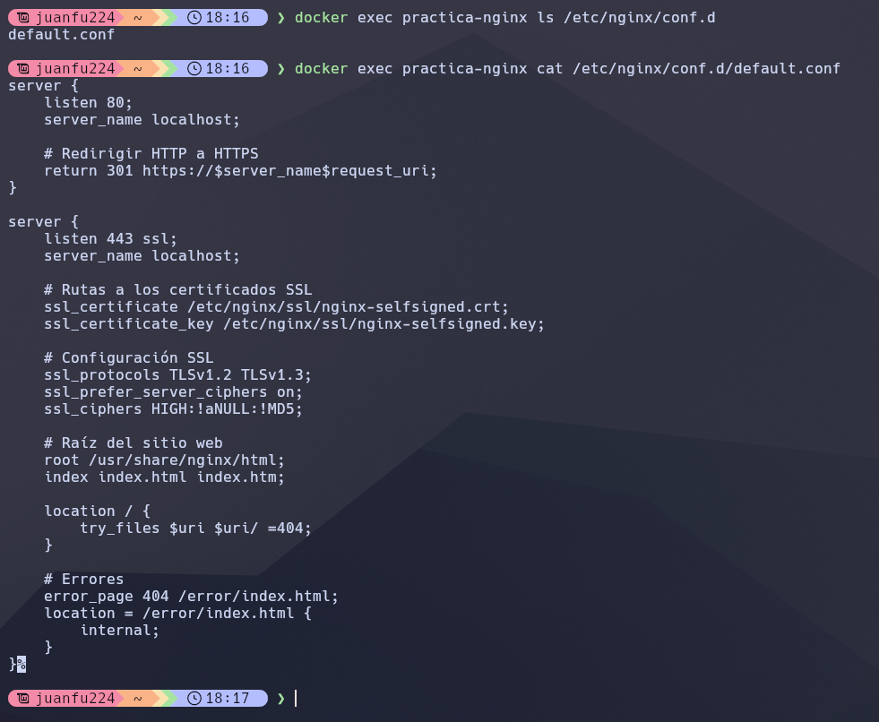
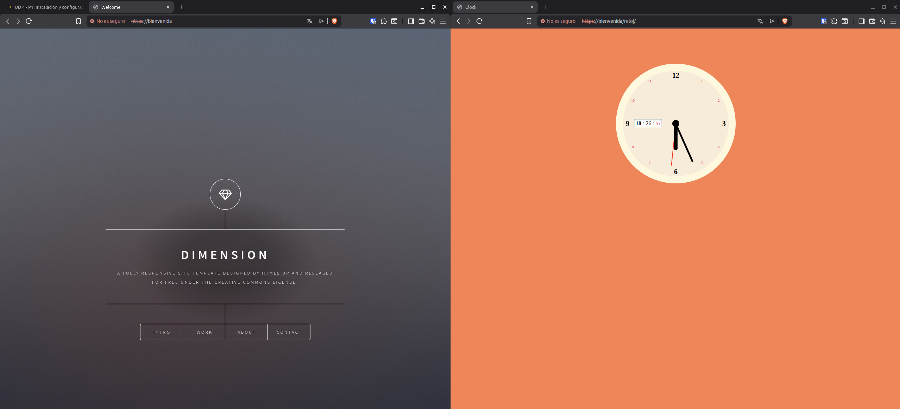
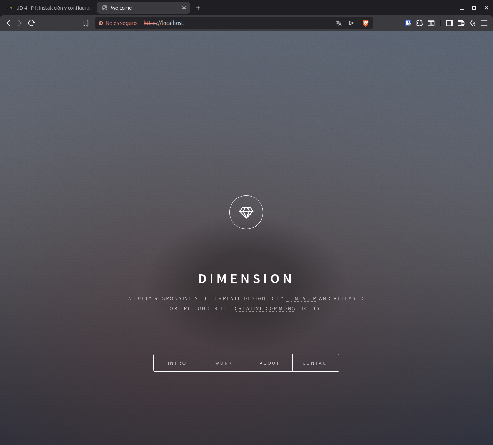
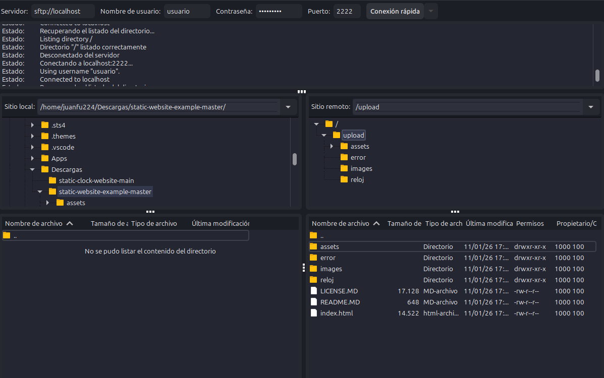
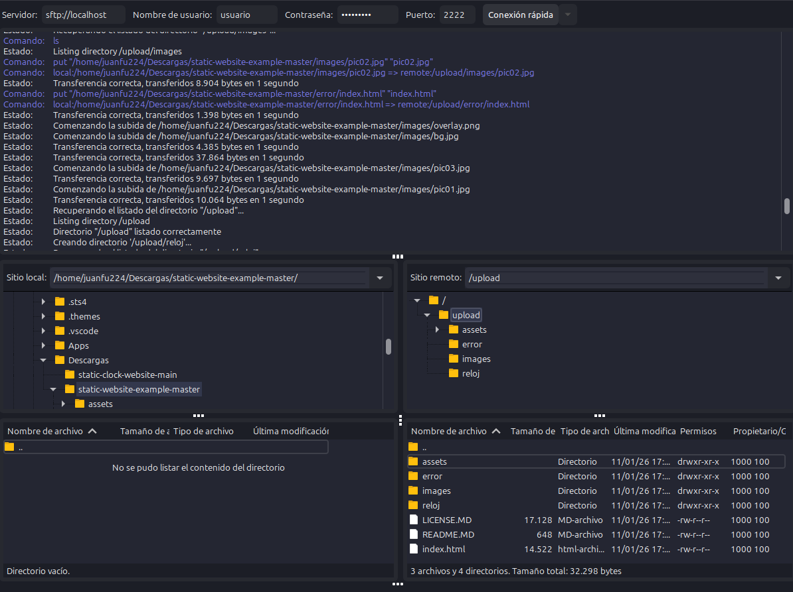
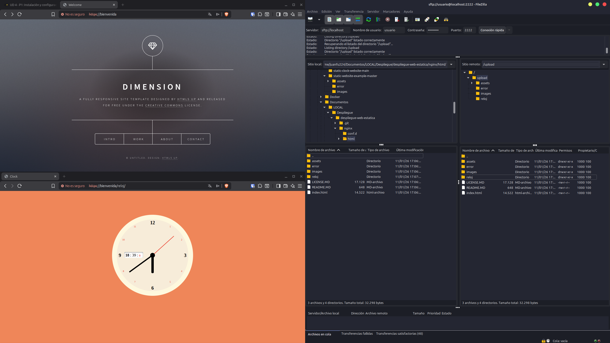
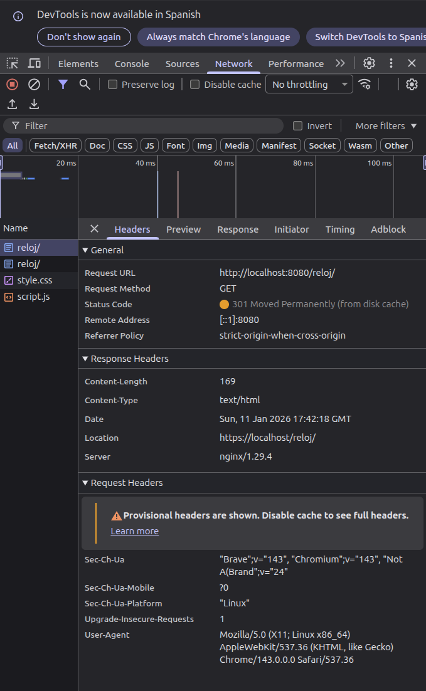

# Despliegue de Aplicación Web Estática con Nginx y Docker

## Descripción del Proyecto

Este proyecto consiste en el despliegue de una aplicación web estática utilizando Nginx como servidor web, SFTP para la transferencia de archivos, y Docker para la infraestructura de contenedores. Se implementa HTTPS mediante certificados autofirmados para garantizar la seguridad de las comunicaciones.

## Infraestructura

- **Servidor Web**: Nginx (mainline-alpine)
- **Transferencia de Archivos**: SFTP (atmoz/sftp:alpine)
- **Orquestación**: Docker Compose
- **Protocolo Seguro**: HTTPS con certificados autofirmados

## Evidencias de Implementación

### Fase 1: Instalación y Configuración

#### 1. Servicio Nginx Activo

**Estado**: ✅ Completado

**Descripción**: El servidor web está instalado y corriendo en el sistema base.

**Evidencia requerida**: Captura del comando `docker compose ps` o `service nginx status` mostrando el servicio activo.

**Captura**:


---

#### 2. Configuración Cargada

**Estado**: ✅ Completado

**Descripción**: Se ha cargado el archivo de configuración del sitio.

**Evidencia requerida**: Captura listando el directorio de configuración dentro del contenedor (ej: `ls -l /etc/nginx/conf.d/`).

**Captura**:


---

#### 3. Resolución de Nombres

**Estado**: ✅ Completado

**Descripción**: Configuración del archivo `/etc/hosts` para usar un nombre en vez de la IP.

**Evidencia requerida**: Captura del navegador donde la barra de direcciones muestre `http://nombre_web` (no la IP) y se vea la página cargada.

**Captura**:



---

#### 4. Contenido Web

**Estado**: ✅ Completado

**Descripción**: Se visualiza la web de "Cloud Academy" en lugar de la página por defecto de Nginx.

**Evidencia requerida**: Captura del navegador mostrando claramente el diseño de la web importada.

**Captura**:


---

### Fase 2: Transferencia SFTP (Filezilla)

#### 5. Conexión SFTP Exitosa

**Estado**: ✅ Completado

**Descripción**: Conexión establecida mediante claves o usuario/contraseña al servidor.

**Evidencia requerida**: Captura de Filezilla mostrando "Status: Connected to..." y el listado de carpetas remoto.

**Captura**:


---

#### 6. Permisos de Escritura

**Estado**: ✅ Completado

**Descripción**: Se ha logrado subir archivos sin error de "Permission denied".

**Evidencia requerida**: Captura de Filezilla mostrando la transferencia completada o los archivos presentes en el servidor remoto.

**Captura**:


---

### Fase 3: Infraestructura Docker

#### 7. Contenedores Activos

**Estado**: ✅ Completado

**Descripción**: Nginx y SFTP están corriendo simultáneamente.

**Evidencia requerida**: Captura del comando `docker compose ps` mostrando los dos servicios con estado "Up" y los puertos mapeados.

**Captura**:


---

#### 8. Persistencia (Volumen Compartido)

**Estado**: ✅ Completado

**Descripción**: Lo que se sube al SFTP se visualiza en la web.

**Evidencia requerida**: Captura con Filezilla y el navegador mostrando que son los mismos archivos.

**Captura**:


---

#### 9. Despliegue Multi-sitio

**Estado**: ✅ Completado

**Descripción**: Se ha desplegado la segunda web (Reloj) en una subcarpeta.

**Evidencia requerida**: Captura del navegador en `http://localhost:8080/reloj/` mostrando el reloj funcionando.

**Captura**:


---

### Fase 4: Seguridad HTTPS

#### 10. Cifrado SSL

**Estado**: ✅ Completado

**Descripción**: El servidor responde a peticiones seguras.

**Evidencia requerida**: Captura del navegador accediendo por `https://` mostrando el candado o alerta de certificado autofirmado.

**Captura**:


---

#### 11. Redirección Forzada

**Estado**: ✅ Completado

**Descripción**: HTTP redirige automáticamente a HTTPS.

**Evidencia requerida**: Captura de la pestaña "Red" (F12) mostrando código de estado 301 (Moved Permanently) al intentar entrar por HTTP.

**Captura**:


---

## Estructura del Proyecto

```
despliegue-web-estatica/
├── docker-compose.yml
├── default.conf
├── nginx-selfsigned.crt
├── nginx-selfsigned.key
├── images/
├── nginx/
│   └── html/
│       ├── index.html
│       ├── assets/
│       ├── error/
│       ├── images/
│       └── reloj/
└── README.md
```

## Instrucciones de Despliegue

### Requisitos Previos

- Docker y Docker Compose instalados
- OpenSSL para generar certificados
- Cliente FTP (Filezilla recomendado)

### Pasos de Instalación

1. **Generar certificados SSL**:

   ```bash
   openssl req -x509 -nodes -days 365 -newkey rsa:2048 -keyout nginx-selfsigned.key -out nginx-selfsigned.crt
   ```

2. **Levantar la infraestructura**:

   ```bash
   docker compose up -d
   ```

3. **Verificar los contenedores**:

   ```bash
   docker compose ps
   ```

4. **Acceder a la aplicación**:
   - HTTP: `http://localhost:8080`
   - HTTPS: `https://localhost`
   - Reloj: `http://localhost:8080/reloj`

### Conexión SFTP

- **Host**: `sftp://localhost`
- **Puerto**: `2222`
- **Usuario**: `usuario`
- **Contraseña**: `libre1234`

## Configuración de Hosts

Para acceder mediante nombre de dominio, añadir al archivo `/etc/hosts` (Linux) o `C:\Windows\System32\drivers\etc\hosts` (Windows):

```
127.0.0.1   nombre_web
```

## Comandos Útiles

```bash
# Ver logs de los contenedores
docker compose logs -f

# Reiniciar servicios
docker compose restart

# Detener infraestructura
docker compose down

# Reconstruir contenedores
docker compose up -d --build
```

## Referencias

- [Documentación oficial de Nginx](https://nginx.org/en/docs/)
- [Guía de Docker Compose](https://docs.docker.com/compose/)
- [Práctica original](https://revilofe.github.io/section4/u04/practica/DAW-U4.-Practica001/)

## Autor

Juan Felipe Arias Aguirre

## Licencia

Este proyecto es parte de una práctica educativa.
